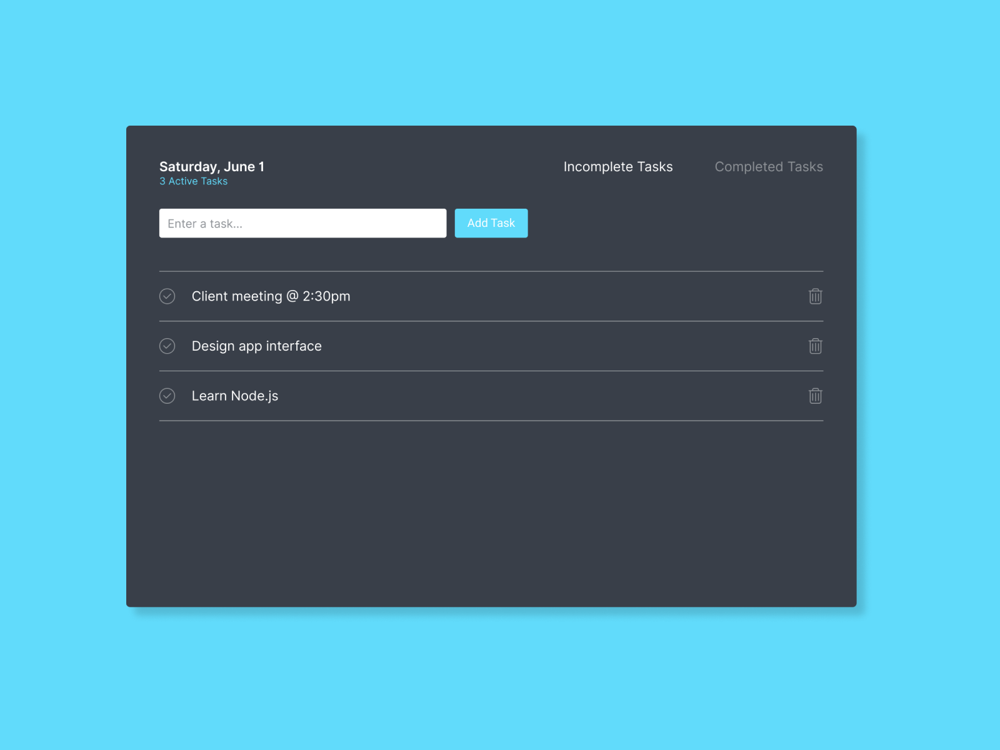

# React Todo List

Simple react todo list

### Project’s idea



### How to use it in local ?

1. Clone the project
2. Install dependencies

```
npm install
```

3. Run the project

```
npm start
```

### Stack

      * React JSX
      * Javascript ES6+
      * Sass

### Author

Written by me and design by [Ian Trent]('https://dribbble.com/iantrent).
